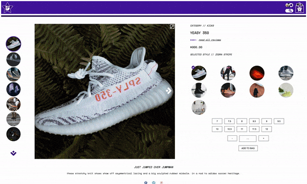
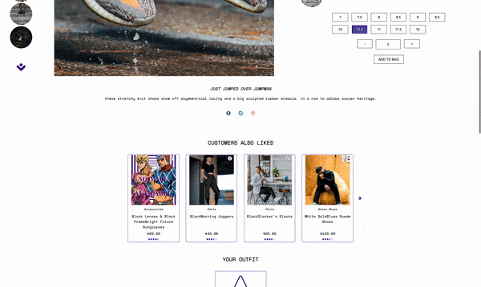
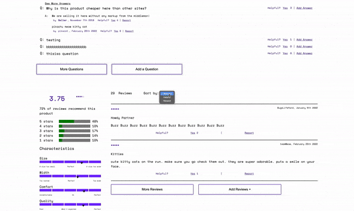

# FEC #
---
## Overview ##

This is a multi widget web page that takes a [modern approach](https://xd.adobe.com/view/e600dc0f-454c-44e3-5075-7872d04189ff-9031/?fullscreen) to a retail website. A requested overarching theme was taken into consideration for stylistic decisions.
---
## Getting started ##

### Installation ###

To run this program, inside of the project's root directory you will need to:

  1. `npm install`
  
      *For a full list of dependencies reference the package.json*
  3. Generate a Github personal API token with the following permissions:
     - read:org
     - read:user
     - user:email
     - user:follow
     
  3. Make a copy of the example file config.js to include your personal API token.
  4. `npm run build`
  5. `npm install forever -g`

### Running the page ###

To run this page you will need to:

  1. Run `npm run forever-server` in the project's root directory
  2. Open your browser to localhost:3000
  3. To shut down your server run the command `npm run stop-forever`

---
## Contents ##

### This website is separated into 4 major widgets: ###

  1. The **Product Overview** module, created by Eunice Kim, is the main visual representation of the selected product and its given styles
     - Functionality and display:
       - Image gallery offers a default collapsed view and expanded view that allows alternate views of the same style
       - Styles can be changed via the style selector to the right of the main image
       - Size and quantity is reflected dynamically based on the style selected and the current inventory
       - An "add to cart" feature allows for a product with its selected style, size, and quantity to be added to the cart

  &emsp;  &emsp;  &emsp; &emsp; &emsp; &emsp; &emsp; 
       
  2. The **Related Items & Comparison** module, created by Alex Shiao, will display two carousels populated by product cards
     - Considerations:
       - The outfits carousel only shows three items so that outfits can be added at any given location in the carousel
     - Functionality and display:
       - The first carousel shows the items related to the current product
       - Each card in the first carousel features a compare button that compares that item with the current item
       - The second carousel shows the items that has been added to the outfit list
       - The outfit list persists through page navigation
       - Each card in the second carousel features a delete button that removes the undesired outfit from the list
   
  &emsp;  &emsp;  &emsp; &emsp; &emsp; &emsp; &emsp; 
     
  3. The **Questions & Answers** module, created by Casey Eads, allows access to product specific information outside what's provided by the Overview
     - Considerations:
       - Make the traversal of information and access to new information responive and intuitive
     - Functionality and display:
       - Search bar at the top allowing matching question to be found after 3 or more characters have been input
       - List of already asked questions and provided answers ordered by Seller, then level of helpfulness
       - Ability to mark questions and answers as helpful or report answers
       - Modals to provide a new question or answer an existing one
   
  &emsp;  &emsp;  &emsp; &emsp; &emsp; &emsp; &emsp; 
       
  4. The **Ratings & Reviews** module, created by Adarsh Ravindran, will allow viewing and submission of reviews for the product selected
     - functionality and display
       - Write new review - accessible by clicking the Write Review button towards the bottom of the page. allows a review to be written about a product 
       - Review List - displays reviews of the current product
       - Product review breakdown - gives the overall reviews of the product as well as breakdowns for individual stars and specific characteristics
  
  &emsp;  &emsp;  &emsp; &emsp; &nbsp;&nbsp; 
---
## Contacts ##

Adarsh Ravindran &emsp;  &emsp; 

Casey Eads &emsp; &emsp; &emsp;&nbsp;  &emsp; 

Eunice Kim &emsp; &emsp; &emsp; &nbsp;  &emsp; 

Alex Shiao &emsp; &emsp; &emsp; &nbsp;&nbsp;  &emsp; 

---
## Technologies ##

- Setup and Configuration:&nbsp; &nbsp;
 
 
 
 
 
- Front End Development: &nbsp; &nbsp;
  
  
  
  
  
- Back End Development: &emsp;
  
  
  
  
- Testing Environment: &emsp; &emsp;
  
  
  
- Team Collaboration: &emsp; &emsp; &nbsp;
  
  
  
